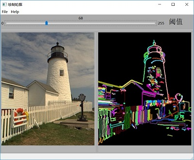
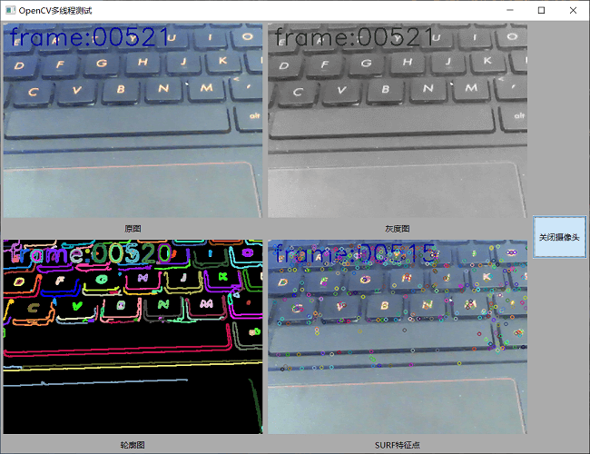

# wxWidgets-practice
wxWidgets+wxFormBuilder+OpenCV

## 测试环境
* wxWidgets 3.0.3
* wxFormBuilder 3.5.1
* OpenCV 3.3
* Visual Studio 2015 Community

## 文件结构说明
* common 存放所有例程共用的函数文件
* img 存放测试图片
* result存放测试结果图片
* ForTest存放尚未完善的测试代码
* 其余的文件夹为单独的例程代码（包含代码与fpb文件）

## 例程目录

* #### calcSquare
  计算平方数

  

* #### cameraTest
  摄像头测试

  

* #### findContours
  查找图片轮廓

  

* #### openPic
  打开图片测试

  
  
* #### openBigPic
  打开大尺寸图片测试（滚动窗口）

  
  
* #### picAdaption
  图像铺满窗口与自适应窗口

  

* #### serialTest
  串口测试

  
  
* #### cvThread
  OpenCV多线程测试

  
  
* #### wxMathPlot
  MathPlot二维图形显示测试
  
  
 

  
* #### socketTest
  wxSocket的测试，基于wxWidgets官方sockets例程，重新使用wxFormBuilder设计GUI，并添加基于TCP协议的文件传输功能
  
  
 

### 本代码的参考例程和图片来源
* wxImage与Mat格式转换参考自：[*这里的代码*](https://github.com/yan9a/wxwidgets/blob/master/minimalcv/util.h)

* 用到的测试图片来自：[*这里的图片*](https://github.com/SSARCandy/Coherent-Line-Drawing/tree/master/data)
